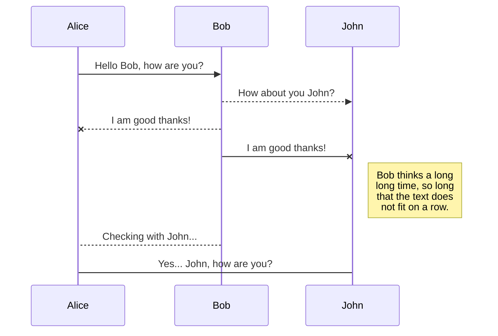
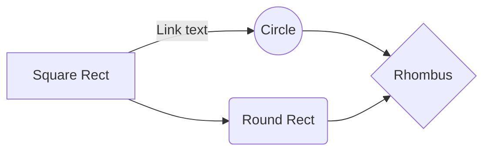

# Movies DB REST API

The following APIs are provided:
- /movies
- /genres
- /search
- /add (requires authentication)
- /delete (requires authentication)
- /update (requires authentication)
- /addgenre (requires authentication)

All the above APIs return the response in JSON format.

## Error conditions
1. For the APIs that require authentication, in case of an invalid API key, the API will return 
```
{
	error: 'authentication failed'
}
```
2.  In case of calling an invalid API,
```
{ 
	error: 'invalid API' 
}
```
## Authentication
For the APIs which require authentication, it is necessary to pass an API key in the body of the POST request.

The following 3 API keys are valid:
```
aba102da-f581-4ff7-a350-b7b671f70e68
68888a10-6c29-4313-8401-e05948a7af18
91f670f4-26c3-4e08-9fee-f44ee1e61484
```
## /movies

Returns an array of all the movies in the database.
Fields returned:
- id
- name
- popularity
- genre (Array of genres)
- imdb_score
- director
```
$curl base_url/movies
```
Response:
```
[
    {
        "imdb_score": 8.8,
        "director": "George Lucas",
        "popularity": 88,
        "id": 2,
        "genre": [
            "Action",
            "Adventure",
            "Fantasy",
            "Sci-Fi"
        ],
        "name": "Star Wars",
        "99popularity": 88,
        "genres": "Action, Adventure, Fantasy, Sci-Fi"
    },
    {
        "imdb_score": 6.6,
        "director": "Giovanni Pastrone",
        "popularity": 66,
        "id": 3,
        "genre": [
            "Adventure",
            "Drama",
            "War"
        ],
        "name": "Cabiria",
        "99popularity": 66,
        "genres": "Adventure, Drama, War"
    },
    {
        "imdb_score": 8.7,
        "director": "Alfred Hitchcock",
        "popularity": 87,
        "id": 4,
        "genre": [
            "Horror",
            "Mystery",
            "Thriller"
        ],
        "name": "Psycho",
        "99popularity": 87,
        "genres": "Horror, Mystery, Thriller"
    },
    {
        "imdb_score": 8,
        "director": "Merian C. Cooper",
        "popularity": 80,
        "id": 5,
        "genre": [
            "Adventure",
            "Fantasy",
            "Horror"
        ],
        "name": "King Kong",
        "99popularity": 80,
        "genres": "Adventure, Fantasy, Horror"
    },
    {
        "imdb_score": 8.4,
        "director": "Fritz Lang",
        "popularity": 84,
        "id": 6,
        "genre": [
            "Adventure",
            "Drama",
            "Sci-Fi"
        ],
        "name": "Metropolis",
        "99popularity": 84,
        "genres": "Adventure, Drama, Sci-Fi"
    },
    {
        "imdb_score": 8.6,
        "director": "Marc Daniels",
        "popularity": 86,
        "id": 7,
        "genre": [
            "Adventure",
            "Sci-Fi"
        ],
        "name": "Star Trek",
        "99popularity": 86,
        "genres": "Adventure, Sci-Fi"
    }
]
```

## /genres
Returns an array of movie genres currently in the DB.

```
$curl base_url/genres
```
Response:
```
[
    {
        "name": "Adventure",
        "id": 2
    },
    {
        "name": "Family",
        "id": 3
    },
    {
        "name": "Fantasy",
        "id": 4
    },
    {
        "name": "Musical",
        "id": 5
    },
    {
        "name": "Action",
        "id": 6
    },
    {
        "name": "Sci-Fi",
        "id": 7
    }
]
```

## /search
Used to search for movies by name and/or director.
Returns an array of all the movies in the database.

### Parameters:
- name (optional)
- director (optional)

**NOTE: either name or director is required. Both can be supplied.**

```
curl --location --request GET 'http://localhost:3001/search?director=Sp'
```
Response:
```
[
    {
        "imdb_score": 8.3,
        "director": "Steven Spielberg",
        "popularity": 83,
        "id": 14,
        "name": "Jaws"
    },
    {
        "imdb_score": 8.7,
        "director": "Steven Spielberg",
        "popularity": 87,
        "id": 35,
        "name": "Raiders of the Lost Ark"
    },
    {
        "imdb_score": 7.9,
        "director": "Steven Spielberg",
        "popularity": 79,
        "id": 39,
        "name": "E.T. : The Extra-Terrestrial"
    },
    {
        "imdb_score": 7.8,
        "director": "Steven Spielberg",
        "popularity": 78,
        "id": 113,
        "name": "Close Encounters of the Third Kind"
    },
    {
        "imdb_score": 7.7,
        "director": "Steven Spielberg",
        "popularity": 77,
        "id": 131,
        "name": "Duel"
    },
    {
        "imdb_score": 7.9,
        "director": "Steven Spielberg",
        "popularity": 79,
        "id": 135,
        "name": "Jurassic Park"
    }
]
```

```
curl --location --request GET 'http://localhost:3001/search?name=Ja' 
```
Response: 
```
[
    {
        "imdb_score": 8.3,
        "director": "Steven Spielberg",
        "popularity": 83,
        "id": 14,
        "name": "Jaws"
    },
    {
        "imdb_score": 8.4,
        "director": "Stanley Kubrick",
        "popularity": 84,
        "id": 220,
        "name": "Full Metal Jacket"
    }
]
```

```
curl --location --request GET 'http://localhost:3001/search?director=Sp&name=Ja'
```
Response:
```
[
    {
        "imdb_score": 8.3,
        "director": "Steven Spielberg",
        "popularity": 83,
        "id": 14,
        "name": "Jaws"
    },
    {
        "imdb_score": 8.4,
        "director": "Stanley Kubrick",
        "popularity": 84,
        "id": 220,
        "name": "Full Metal Jacket"
    }
]
```


# Welcome to StackEdit!

Hi! I'm your first Markdown file in **StackEdit**. If you want to learn about StackEdit, you can read me. If you want to play with Markdown, you can edit me. Once you have finished with me, you can create new files by opening the **file explorer** on the left corner of the navigation bar.


# Files

StackEdit stores your files in your browser, which means all your files are automatically saved locally and are accessible **offline!**

## Create files and folders

The file explorer is accessible using the button in left corner of the navigation bar. You can create a new file by clicking the **New file** button in the file explorer. You can also create folders by clicking the **New folder** button.

## Switch to another file

All your files and folders are presented as a tree in the file explorer. You can switch from one to another by clicking a file in the tree.

## Rename a file

You can rename the current file by clicking the file name in the navigation bar or by clicking the **Rename** button in the file explorer.

## Delete a file

You can delete the current file by clicking the **Remove** button in the file explorer. The file will be moved into the **Trash** folder and automatically deleted after 7 days of inactivity.

## Export a file

You can export the current file by clicking **Export to disk** in the menu. You can choose to export the file as plain Markdown, as HTML using a Handlebars template or as a PDF.


# Synchronization

Synchronization is one of the biggest features of StackEdit. It enables you to synchronize any file in your workspace with other files stored in your **Google Drive**, your **Dropbox** and your **GitHub** accounts. This allows you to keep writing on other devices, collaborate with people you share the file with, integrate easily into your workflow... The synchronization mechanism takes place every minute in the background, downloading, merging, and uploading file modifications.

There are two types of synchronization and they can complement each other:

- The workspace synchronization will sync all your files, folders and settings automatically. This will allow you to fetch your workspace on any other device.
	> To start syncing your workspace, just sign in with Google in the menu.

- The file synchronization will keep one file of the workspace synced with one or multiple files in **Google Drive**, **Dropbox** or **GitHub**.
	> Before starting to sync files, you must link an account in the **Synchronize** sub-menu.

## Open a file

You can open a file from **Google Drive**, **Dropbox** or **GitHub** by opening the **Synchronize** sub-menu and clicking **Open from**. Once opened in the workspace, any modification in the file will be automatically synced.

## Save a file

You can save any file of the workspace to **Google Drive**, **Dropbox** or **GitHub** by opening the **Synchronize** sub-menu and clicking **Save on**. Even if a file in the workspace is already synced, you can save it to another location. StackEdit can sync one file with multiple locations and accounts.

## Synchronize a file

Once your file is linked to a synchronized location, StackEdit will periodically synchronize it by downloading/uploading any modification. A merge will be performed if necessary and conflicts will be resolved.

If you just have modified your file and you want to force syncing, click the **Synchronize now** button in the navigation bar.

> **Note:** The **Synchronize now** button is disabled if you have no file to synchronize.

## Manage file synchronization

Since one file can be synced with multiple locations, you can list and manage synchronized locations by clicking **File synchronization** in the **Synchronize** sub-menu. This allows you to list and remove synchronized locations that are linked to your file.


# Publication

Publishing in StackEdit makes it simple for you to publish online your files. Once you're happy with a file, you can publish it to different hosting platforms like **Blogger**, **Dropbox**, **Gist**, **GitHub**, **Google Drive**, **WordPress** and **Zendesk**. With [Handlebars templates](http://handlebarsjs.com/), you have full control over what you export.

> Before starting to publish, you must link an account in the **Publish** sub-menu.

## Publish a File

You can publish your file by opening the **Publish** sub-menu and by clicking **Publish to**. For some locations, you can choose between the following formats:

- Markdown: publish the Markdown text on a website that can interpret it (**GitHub** for instance),
- HTML: publish the file converted to HTML via a Handlebars template (on a blog for example).

## Update a publication

After publishing, StackEdit keeps your file linked to that publication which makes it easy for you to re-publish it. Once you have modified your file and you want to update your publication, click on the **Publish now** button in the navigation bar.

> **Note:** The **Publish now** button is disabled if your file has not been published yet.

## Manage file publication

Since one file can be published to multiple locations, you can list and manage publish locations by clicking **File publication** in the **Publish** sub-menu. This allows you to list and remove publication locations that are linked to your file.


# Markdown extensions

StackEdit extends the standard Markdown syntax by adding extra **Markdown extensions**, providing you with some nice features.

> **ProTip:** You can disable any **Markdown extension** in the **File properties** dialog.


## SmartyPants

SmartyPants converts ASCII punctuation characters into "smart" typographic punctuation HTML entities. For example:

|                |ASCII                          |HTML                         |
|----------------|-------------------------------|-----------------------------|
|Single backticks|`'Isn't this fun?'`            |'Isn't this fun?'            |
|Quotes          |`"Isn't this fun?"`            |"Isn't this fun?"            |
|Dashes          |`-- is en-dash, --- is em-dash`|-- is en-dash, --- is em-dash|


## KaTeX

You can render LaTeX mathematical expressions using [KaTeX](https://khan.github.io/KaTeX/):

The *Gamma function* satisfying $\Gamma(n) = (n-1)!\quad\forall n\in\mathbb N$ is via the Euler integral

$$
\Gamma(z) = \int_0^\infty t^{z-1}e^{-t}dt\,.
$$

> You can find more information about **LaTeX** mathematical expressions [here](http://meta.math.stackexchange.com/questions/5020/mathjax-basic-tutorial-and-quick-reference).


## UML diagrams

You can render UML diagrams using [Mermaid](https://mermaidjs.github.io/). For example, this will produce a sequence diagram:



And this will produce a flow chart:

